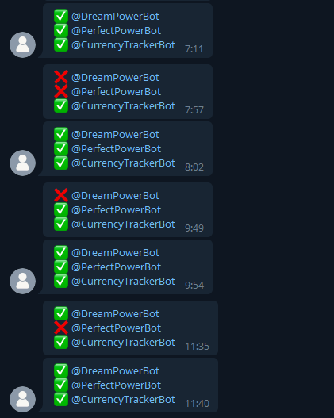

# TelegramStatusBot
Telegram CLI Bot that checks status of other bots





## Installation

Clone repository

```bash
git clone https://github.com/TimNekk/TelegramStatusBot
```

Install requirements

```bash
pip install -r requirements.txt
```

Rename `.env.dist` to `.env `

```bash
# Windows
rename .env.dist .env

# Linux
mv .env.dist .env 
```
    


## Configuration

Complete `.env` file with your data


## Contributing

Bug reports and/or pull requests are welcome


## License

The module is available as open source under the terms of the [Apache License, Version 2.0](https://opensource.org/licenses/Apache-2.0)